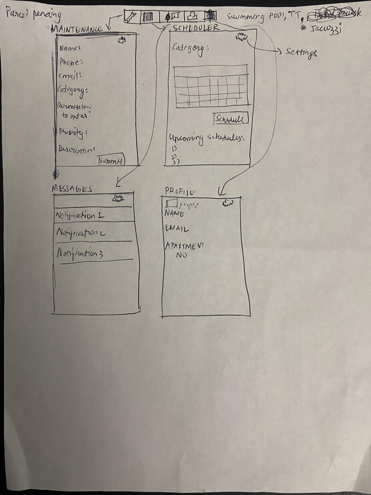
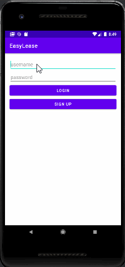

Unit 8: Group Milestone - README Example
===

# EasyLease

## Table of Contents
1. [Overview](#Overview)
1. [Product Spec](#Product-Spec)
1. [Wireframes](#Wireframes)

## Overview
### Description
An application that will allow residents of a housing community. 
1) Maintenance requests 
2) Book/Schedule game and other services

Allow residents to make monthly rental payments via the application.

### App Evaluation
- **Category:** Booking System
- **Mobile:** This app would be primarily developed for mobile. The mobile app would prioiritize easy of use.
- **Story:** Analyzes users booking choices, and connects them to other users with similar interests. The user can then decide to match against each other in a single booking slot.
- **Market:** Any individual could choose to use this app, but our target audience is students to middle age group (14-55 years of age).
- **Habit:** This app could be used as often or unoften as the user wanted based on how often the user needs it.
- **Scope:** Our top three feature would include raising maintenance requests, booking outdoor/sport facilities, food trucks timelines and bookings, and this could further evolve into a monthly rental app.

## Product Spec
### 1. User Stories (Required and Optional)

**Required Must-have Stories**

* [x] User logs in or register a new account
* [] User can raise requests for maintenace or any other complaints
* [] User can view upcoming food truck schedules along with menu.
* [] User can book outdoor facilities like swimming, table tennis, etc.
* [] User can see his messages like arrived packages, mail, monthly rental payment reminders and maintenance requests.
* [] Profile pages for each user
* [] Settings (History, Notification, General, etc.)

**Optional Nice-to-have Stories**

* User has the option to pay monthly rent.
* User can put personal documents for leasing purposes such as monthly rent bills and leasing documents.
* Profile Add-On: User can add top interests for outdoor activites and custom recommendations based on this.

### 2. Screen Archetypes

* Home Page
    * Login 
        * Login page includes mandatory email and password text box.
    * Register - User signs up or logs into their account
        * Sign Up includes email, house number, password, full name
        * Upon Download/Reopening of the application, the user is prompted to log in to gain access to their profile information and the rest of the app for security purposes. 

* Maintenance Selection Screen.
   * Allows user to raise a maintenance requests or complaint.

* Calender Screen - Chat for users to communicate (direct 1-on-1)
   * Showing all the days of the month(clickable) in calendar format
   * Can see the food truck schudule
   * Rent payment dues
   * Outdoor facilities booking     
        * Opens popup showing different booking options and day details

* Messages screen
    * Shows all of the messages like arrived packages, mail, monthly rental payment reminders and maintenance requests.

* Profile Screen 
   * Allows user to upload a photo(optional) and personal details such as full name, apartment number, and email.
* Settings Screen
   * Lets users see or modify settings like app notification settings, terms of service, sign out.

### 3. Navigation

**Tab Navigation** (Tab to Screen)

* Maintenance
* Calendar
* Messages
* Profile

Optional:
* Payment
* Personal documents

**Flow Navigation** (Screen to Screen)
* Forced Log-in -> Account creation if no log in is available
* Maintenance -> File a ticket
* Calendar -> Calendar display/schedule popup on click -> outdoor facility booking popup on click
* Profile -> Text field to be modified. 
* Settings -> Toggle settings

## Wireframes
 

## Schema 
### Models
#### Calender

   | Property      | Type     | Description |
   | ------------- | -------- | ------------|
   | userId      | String   | unique id for the user |
   | eventId        | String | id of event |
   | createdAt     | DateTime | date when event/slot is created (default field) |
   | updatedAt     | DateTime | date when event/slot is last updated (default field) |

#### Ticket Creation

   | Property      | Type     | Description |
   | ------------- | -------- | ------------|
   | userId      | String   | unique id for the user |
   | ticketId        | String | ticket Id |
   | createdAt     | DateTime | date when event/slot is created (default field) |
   | updatedAt     | DateTime | date when event/slot is last updated (default field) |

#### message Page

   | Property      | Type     | Description |
   | ------------- | -------- | ------------|
   | userId      | String   | unique id for the user |
   | messageId        | String | unique id of message |
   | messageDescription     | String | description of messages for user |

#### Profile Page

   | Property      | Type     | Description |
   | ------------- | -------- | ------------|
   | userId      | String   | unique id for the user |
   | email        | String | user email |
   | address     | String | address of user |

### Networking
#### List of network requests by screen
   - Calender Screen
      - (Read/GET) Query all date events when user clicks on day
      - (Create/POST) Create a new event on a day
   - Create Ticket Screen(Complaint/Maintenance Requests)
      - (Create/POST) Create a new ticket object
   - Message Screen
      - (Read/GET) Query logged in user's message list (includes the notification history is it is enabled)
   - Profile Screen
      - (Read/GET) Query logged in user object
      - (Update/PUT) Update user profile information

## Walkthrough Sprint 1
Gif using Licecap of Home screen, Login screen, and Sign Up screen.

 
